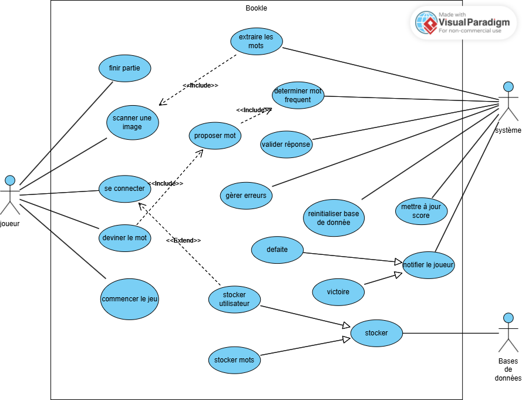
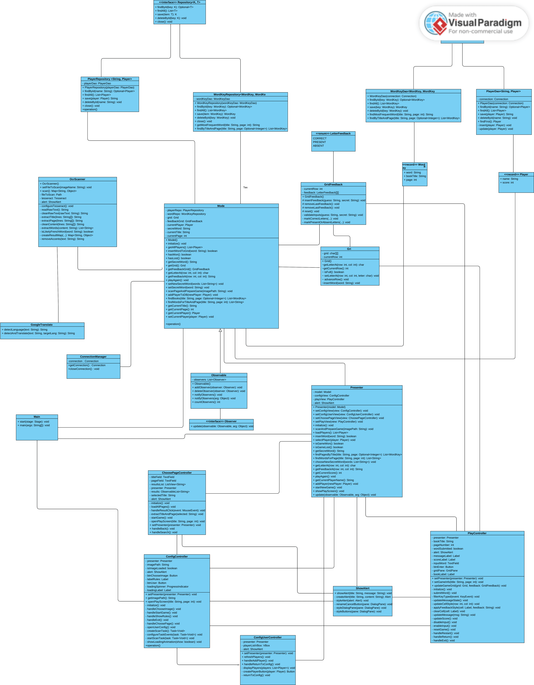
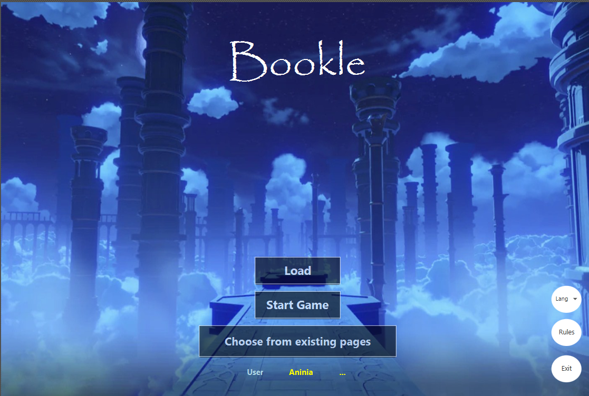
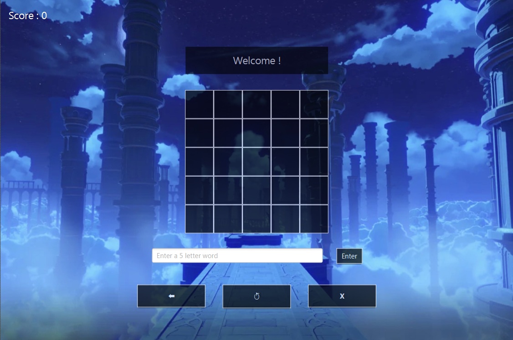
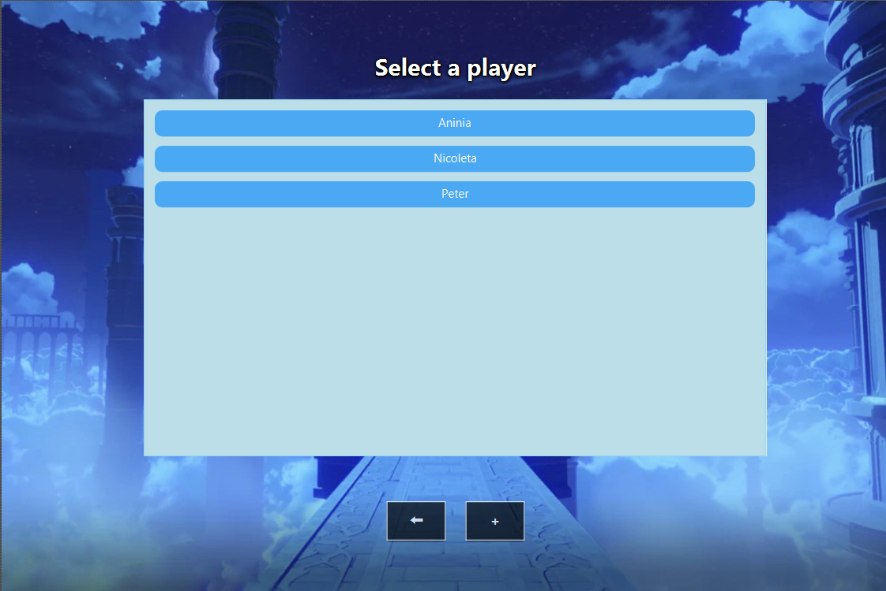
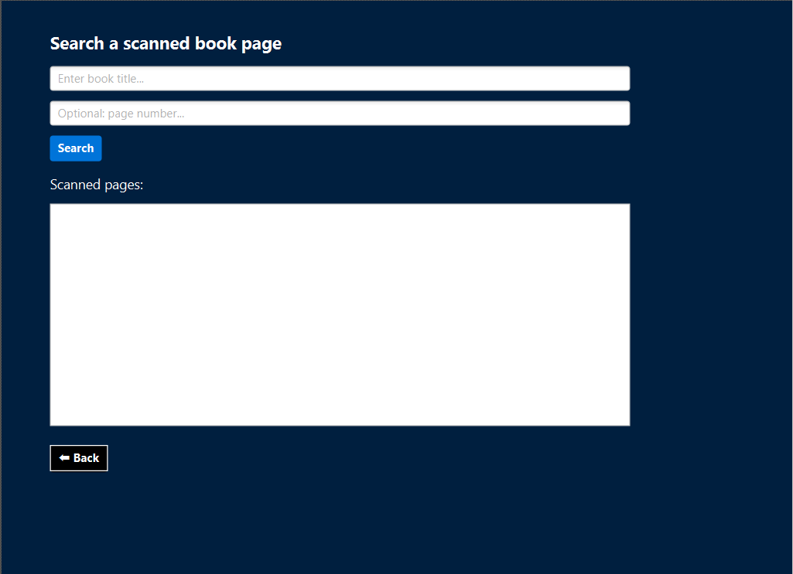

# Bookle

  

## Auteurs

- Groupe D112
- g63731 Opre Nicoleta
- g60991 Negue Abla Aninia

## Description du Projet
Bookle est une application éducative en Java destinée à un public francophone, notamment aux élèves ou apprenants en langue française.

Elle utilise la technologie OCR (Tesseract) pour analyser automatiquement le contenu textuel d’une image de page de livre.
Une fois le texte reconnu, l'application détecte sa langue d'origine (anglais, néerlandais, roumain, catalan...) et le traduit automatiquement en français grâce à l’API Google Translate.

L’objectif est de transformer ces textes en une source de vocabulaire ludique : les mots de 5 lettres valides sont extraits et utilisés dans un jeu de type Wordle.

Le joueur dispose de 5 essais pour trouver un mot mystère :

🟩 Lettre bien placée : vert

🟨 Lettre mal placée : jaune

⚫ Lettre absente : noir

Un système de score valorise la rapidité :
50 points à la 1ère ligne, jusqu’à 10 à la dernière.
Bookle permet ainsi de jouer, apprendre du vocabulaire, et interagir avec des textes réels, même traduits depuis d'autres langues.


### Objectifs Principaux
Proposer un jeu de devinette basé sur des mots de 5 lettres en français
Appliquer une logique de feedback visuel (vert / jaune / noir)
Intégrer un système de score progressif
Limiter le joueur à 5 essais par mot

## Description des Besoins
### 1. **Besoins Fonctionnels**
**Scanner un document** (image d’une page de livre) depuis l’interface utilisateur.

**Extraire automatiquement les mots** du document via un moteur OCR comme Tesseract.

**Détecter la langue du texte**, et si ce n’est pas du français, le traduire automatiquement via une API (Google Translate).

**Nettoyer et filtrer le texte**: suppression des caractères spéciaux, ponctuation, accents, doublons.

**Vérifier la validité des mots** (mots français, uniquement 5 lettres).

**Stocker les mots** extraits dans une base de données SQLite, en évitant les doublons.

**Lancer un jeu interactif** où l’utilisateur doit deviner un mot de 5 lettres parmi ceux extraits, avec 5 essais maximum.

**Mettre à jour le score du joueur** en fonction de ses performances (nombre d’essais).
---

### 2. **Besoins Non Fonctionnels**
**Performance** : l’analyse OCR, la traduction et l’extraction des mots doivent s’exécuter rapidement, même pour des images complexes.

**Accessibilité** : l’interface utilisateur doit rester simple, intuitive et fluide, en particulier grâce à l’utilisation de JavaFX avec FXML.

**Scalabilité**: l’application doit pouvoir gérer un grand volume de mots et de pages scannées sans perte de performance.

## Cas d'utilisation

Les cas d'utilisation ci-dessous montre ce qu'on peut faire avec notre application.



## Diagramme de Classe

Le diagramme de classe ci-dessous illustre la structure de l'application.




## Maquette d'écran

Maquette de la page de la configuration du jeu:



Maquette de la page de la principale du jeu:



Maquette de la page qui affiche les joueurs et leur score et ou on peut changer de player:




Maquette de la page ou on choisi une page déjà scannée:




## Choix de l'Architecture

Le projet a été développé en suivant le modèle d'architecture MVP (Model - View - Presenter) afin de mieux séparer la logique métier, l'affichage et le contrôle des données. Cette structure facilite la maintenance, les tests et l’évolution du code.


## Plan de Tests Fonctionnels

Les tests fonctionnels élémentaires pour le projet sont les suivants :


### Objectifs des tests
- Vérifier le bon fonctionnement de chaque fonctionnalité.  
- Identifier les éventuelles anomalies avant la mise en production.  
- Assurer une expérience utilisateur fluide.

### Scénarios de test

###  3.1 Test de la connexion utilisateur  
| ID Test | Description | Étapes | Résultat Attendu | Statut |
|---------|------------|--------|------------------|--------|
| T1 | Connexion réussie | 1. Ouvrir l’application <br> 2. Saisir identifiants valides <br> 3. Valider | L’utilisateur est connecté et redirigé vers l’accueil | testé |
| T2 | Connexion échouée (identifiants invalides) | 1. Ouvrir l’application <br> 2. Saisir des identifiants incorrects <br> 3. Valider | Un message d’erreur s’affiche | testé |

---

###  3.2 Test de l’OCR et extraction des mots  
| ID Test | Description | Étapes | Résultat Attendu | Statut |
|---------|------------|--------|------------------|--------|
| T3 | Scan d’un document | 1. Sélectionner un document PDF ou une image <br> 2. Lancer l’analyse OCR | Le texte est extrait correctement | testé |
| T4 | Identification des mots| 1. Scanner un document <br> 2. Lancer l’analyse OCR | Le mot de 5 lettres |testé|

---

###  3.3 Test du jeu  
| ID Test | Description | Étapes | Résultat Attendu | Statut |
|---------|------------|--------|------------------|--------|
| T5 | Démarrer une partie | 1. Cliquer sur "Commencer le jeu" | Le jeu démarre avec un mot à deviner | testé |
| T6 | Deviner un mot (réponse correcte) | 1. Saisir une réponse correcte <br> 2. Valider | Le score est mis à jour et un message de succès s’affiche | testé |
| T7 | Deviner un mot (réponse incorrecte) | 1. Saisir une réponse incorrecte <br> 2. Valider | Un message d’erreur s’affiche et les essais restants sont mis à jour | testé |
| T8 | Fin de partie | 1. Jouer jusqu’à épuisement des essais <br> 2. Vérifier le score final | La partie se termine et le score est enregistré | testé |

---

### 3.4 Test de la base de données  
| ID Test | Description | Étapes | Résultat Attendu | Statut |
|---------|------------|--------|------------------|--------|
| T9 | Enregistrement du score | 1. Terminer une partie | Le score est enregistré en base de données | testé |
| T10 | Récupération des scores | 1. Consulter les scores | Les scores sont affichés correctement | testé |

---

###  3.5 Test de la base de données des mots extraits  
| ID Test | Description | Étapes | Résultat Attendu | Statut |
|---------|------------|--------|------------------|--------|
| T11 | Enregistrement des mots extraits | 1. Scanner un document <br> 2. Vérifier la base de données | Tous les mots extraits sont enregistrés en base de données | testé |
| T12 | Suppression des anciens mots après réinitialisation | 1. Réinitialiser la base de données <br> 2. Vérifier la base | Tous les anciens mots sont supprimés | testé |
| T13 | Récupération du mot | 1. Scanner un document <br> 2. Vérifier la base de données | Le mot est bien enregistré et récupérable | testé |

---


## Calendrier Hebdomadaire des Tâches

###  (31 mars – 6 avril) – 6H

| Qui       | Description  
|--         | --
|Nicoleta      | Initialisation de Git
|Nicoleta        | Configuration de l'environnement de développement

### Semaine  2 (7 – 13 avril) – 6H

| Qui       | Description  
|--         | --
|Nicoleta      | Implémentation de la partie OCR et FXML 
|Aninia        | Implémentation de la base de données


### Semaine 3  (14 – 20 avril) – 6H
| Qui       | Description  
|--         | --
|Nicoleta   | Implémentation de controlleurs
|Aninia     | redaction du diagramme de classe


### Semaine 4 (21 – 27 avril) – 6H
| Qui       | Description  
|--         | --
|Nicoleta    | Nettoyage du texte (ponctuation, accents, doublons)
|Aninia      | Ajout de la détection de langue et de la traduction (Google Translate API)


### Semaine 5  (28 avril – 4 mai) – 6H
| Qui       | Description  
|--         | --
|Nicoleta    | Intégration de la logique du jeu (feedback couleur, essais)
|Aninia      | 	Système de score automatique


### Semaine  6 (5 – 11 mai) – 6H
| Qui       | Description  
|--         | --
|Nicoleta    |nettoyage du code vidéo de présentation et video de presentation
|Aninia      |Réalisation du README, vidéo de présentation


## Installation et utilisation

Pour utiliser l'application, suivez les étape suivantes : 

1. Clonez ce repository :
   ```bash
   git clone https://git.esi-bru.be/63731/4-prj-1-d-d-112-g-63731-g-60991.git
   ```

2. Ouvrir le projet dans un IDE compatible (IntelliJ recommandé).
Assurez-vous que Maven est configuré correctement.

3. Intallation de Scene Builder
    Téléchargez JavaFX SDK 17 (ou compatible).

   Ajoutez le chemin JavaFX à votre configuration d'exécution.

   4.Installer Tesseract OCR :

   Téléchargez Tesseract OCR depuis https://github.com/tesseract-ocr/tessdata
